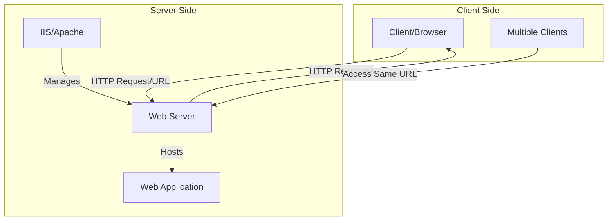
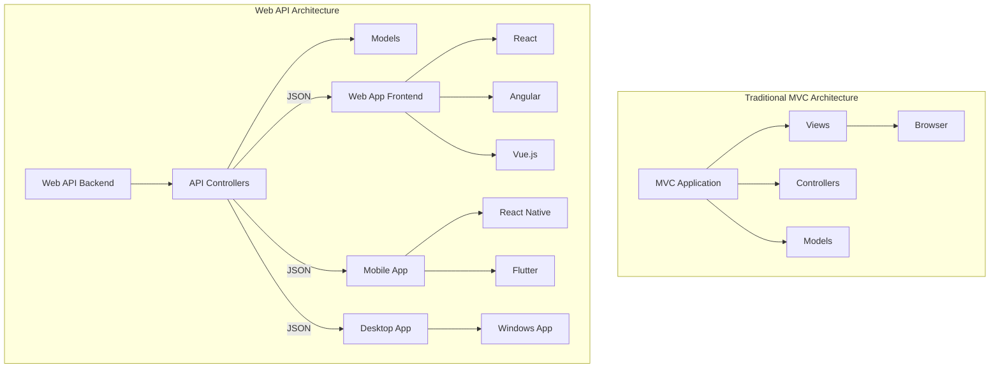
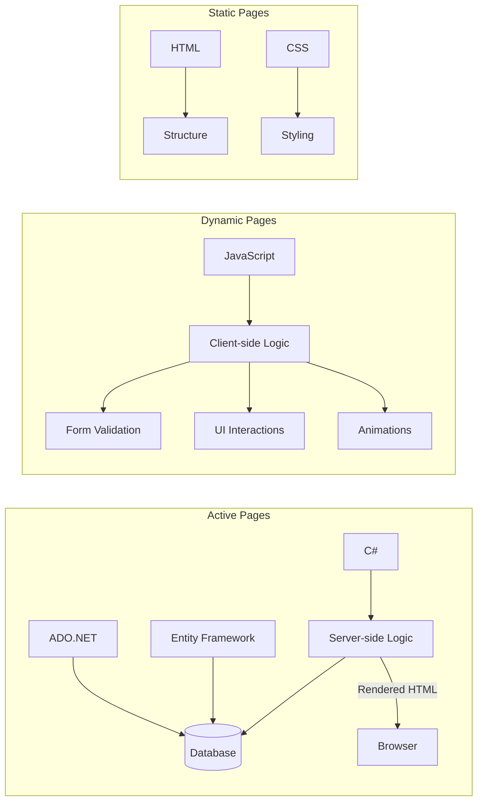
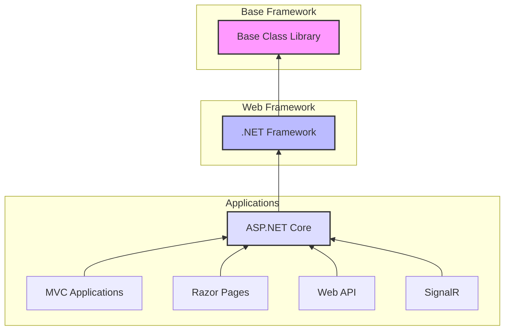

# Understanding Web vs Desktop Applications in ASP.NET MVC

## Introduction
This document outlines the key differences between web applications (like those built with ASP.NET MVC) and traditional desktop applications, explaining their deployment, usage, and maintenance characteristics.

## Comparison Table

| Aspect | Desktop Applications | Web Applications |
|--------|---------------------|------------------|
| Installation | Requires local installation on each computer | No installation needed; accessed via browser |
| Updates | Must be deployed to each computer individually | Updated once on server, available to all users |
| Requirements | Source files and installation process | Internet connection and web browser |
| Distribution | Physical deployment or download required | Accessible via URL |
| Access | Limited to installed computer | Available worldwide with internet access |
| Example | Microsoft Office, Pharmacy Systems | Online banking, Social media platforms |

## Web Application Architecture

### Server Side Components
1. **Web Server**
   - Hosts multiple websites/applications
   - Runs server software (IIS for Windows, Apache for open source)
   - Handles multiple client requests simultaneously
   - Provides various services:
     - Web pages (HTTP)
     - File transfer (FTP)
     - Email (SMTP)

2. **Hosting**
   - Applications deployed to hosting providers
   - Each application assigned unique domain name/URL
   - Single server can host multiple applications
   - Server handles request routing based on domain

### Client Side Requirements
1. **Minimum Requirements**
   - Web browser
   - Internet connection
   - No local installation needed

2. **Access Process**
   - User enters URL in browser
   - Browser sends request to server
   - Server processes request
   - Server returns response to client

## Advantages of Web Applications

1. **Centralized Updates**
   - Changes made once on server
   - All users immediately see updates
   - No need for client-side deployment

2. **Accessibility**
   - Access from any device with internet
   - No installation required
   - Platform independent

3. **Maintenance**
   - Easier to maintain and update
   - No need for client-side visits
   - Reduced deployment complexity

## ASP.NET MVC Specific Notes

1. **Output**
   - Projects compile to websites, not desktop applications
   - Deployed to web servers
   - Accessed through browsers

2. **Development Workflow**
   - Develop locally
   - Test on development server
   - Deploy to production server
   - Users access via URL

## Best Practices

1. **Deployment**
   - Purchase appropriate hosting package
   - Secure domain name
   - Configure web server properly
   - Implement proper security measures

2. **Performance**
   - Consider server capabilities
   - Optimize for multiple concurrent users
   - Implement caching strategies
   - Monitor server resources





# Web Development Architectures: MVC vs Web API

## 1. Traditional MVC Architecture (Monolithic)

### Characteristics
- Combined frontend and backend in single application
- Tightly coupled architecture
- Server-side rendering of views
- Direct integration between components

### Components
1. **Models**: Data and business logic
2. **Views**: User interface templates
3. **Controllers**: Handle user requests
4. **Single Codebase**: Everything in one project

### Advantages
- Simpler initial setup
- Straightforward development workflow
- Good for smaller applications
- Direct template rendering

### Limitations
- Less flexible for multiple platforms
- Tighter coupling between frontend and backend
- More difficult to scale independently
- Limited reusability across platforms

## 2. Web API Architecture (Separated Frontend/Backend)

### Backend (Web API)
1. **Characteristics**
   - Focused solely on business logic and data
   - RESTful API endpoints
   - JSON/XML responses
   - Platform-independent

2. **Benefits**
   - Single backend serves multiple frontends
   - Clean separation of concerns
   - Easier to scale
   - Better maintainability

### Frontend Options
1. **Web Applications**
   - React
   - Angular
   - Vue.js
   - Ajax-based applications

2. **Mobile Applications**
   - React Native
   - Flutter
   - Native iOS/Android consuming API

3. **Desktop Applications**
   - Windows Applications
   - Electron Apps
   - Progressive Web Apps (PWA)

## Key Benefits of Web API Architecture

### 1. Code Reusability
- Single backend serves multiple platforms
- Write once, use everywhere approach
- Consistent business logic across platforms

### 2. Flexibility
- Independent frontend development
- Easy to add new client applications
- Technology-agnostic frontend choices

### 3. Scalability
- Independent scaling of frontend and backend
- Easier maintenance and updates
- Better resource optimization

### 4. Development Efficiency
- Parallel development possible
- Specialized teams for frontend and backend
- Easier testing and deployment

## Implementation Considerations

### Backend (Web API)
1. **API Design**
   - RESTful principles
   - Clear endpoint structure
   - Proper authentication/authorization
   - Efficient data transfer

2. **Documentation**
   - API documentation
   - Swagger/OpenAPI
   - Clear endpoint specifications

### Frontend
1. **Framework Selection**
   - Based on project requirements
   - Team expertise
   - Performance needs
   - Target platform

2. **Integration**
   - API consumption strategies
   - Error handling
   - State management
   - Data caching

## Best Practices

1. **Architecture Planning**
   - Choose based on project scale
   - Consider future requirements
   - Evaluate team capabilities
   - Assessment of scalability needs

2. **Development Workflow**
   - Clear API contracts
   - Version control strategy
   - Testing strategy
   - Deployment pipeline

3. **Security**
   - OAuth/JWT implementation
   - CORS configuration
   - Data validation
   - Security headers




# Evolution of Web Development: From Static to Active Pages

## 1. Static Pages (First Generation)

### Technologies
- HTML (Structure)
- CSS (Styling)

### Characteristics
- Fixed content
- No dynamic updates
- Same content for all users
- Client-side only
- No database interaction

### Limitations
- Cannot change content without modifying source
- No user interactivity
- No data persistence

## 2. Dynamic Pages (Second Generation)

### Technologies
- HTML
- CSS
- JavaScript

### Added Capabilities
1. **User Interaction**
   - Button clicks
   - Form validation
   - Alerts and notifications
   - Animations

2. **Dynamic Content**
   - Show/hide elements
   - Modify content without reload
   - Interactive forms
   - Client-side calculations

### Limitations
- No database connectivity
- Cannot persist data
- Limited to client-side operations

## 3. Active Pages (Third Generation)

### Technologies
- HTML/CSS (Frontend)
- JavaScript (Client-side logic)
- C# (Server-side logic)
- Database (Data storage)

### Server-Side Integration
1. **C# Backend**
   - Processes requests
   - Handles business logic
   - Database communication
   - Renders HTML responses

2. **Database Connectivity Options**
   - Entity Framework
     - Object-Relational Mapping
     - Code-first approach
     - Database-first approach
   - ADO.NET
     - Direct SQL commands
     - More control over queries

### Data Flow
1. **Request Process**
   - Client makes request via HTML
   - C# processes request
   - Database query executed
   - Data retrieved
   - HTML rendered with data
   - Response sent to client

2. **Common Operations**
   - Read records from database
   - Write new records
   - Update existing data
   - Delete records
   - Real-time data display

### Benefits
1. **Data Persistence**
   - Information stored in database
   - Available across sessions
   - Shared among users

2. **Real-time Updates**
   - Latest data always available
   - Multiple user support
   - Consistent data state

3. **Rich Functionality**
   - Complex business logic
   - Data validation
   - Security features
   - User authentication

## Best Practices

### 1. Separation of Concerns
- Frontend for presentation
- Backend for business logic
- Database for data storage

### 2. Security
- Input validation
- Data sanitization
- Secure database access
- Authentication/Authorization

### 3. Performance
- Efficient database queries
- Proper caching
- Optimized data transfer
- Response time optimization

### 4. Maintenance
- Clean code structure
- Documentation
- Version control
- Error handling




# .NET Framework Architecture and Web Development

## 1. Base Layer: .NET Framework

### Core Components
- Base Class Library (BCL)
- Common runtime environment
- Fundamental data types
- Collections framework
- System utilities

### Capabilities
- Console applications
- Class libraries
- Desktop applications
- Core infrastructure

## 2. Middle Layer: ASP.NET Core

### Characteristics
- Open-source web framework
- Cross-platform compatibility
- Modern web development features
- Optimized performance
- Community-driven development

### Key Features
- Built-in dependency injection
- Cross-platform support
- Modular architecture
- High performance
- Modern development patterns

## 3. Application Layer

### Web Applications (Frontend + Backend)
1. **MVC (Model-View-Controller)**
   - Complete web applications
   - Server-side rendering
   - Full-stack development
   - Integrated frontend/backend

2. **Razor Pages**
   - Page-focused scenarios
   - Simplified web development
   - Built-in view engine
   - Page-based programming model

### Web Services (Backend Only)
1. **Web API**
   - RESTful services
   - HTTP-based APIs
   - Data-centric services
   - Platform-independent interfaces

2. **SignalR**
   - Real-time communications
   - WebSocket functionality
   - Push notifications
   - Live updates

## Framework Benefits

### 1. Integration
- Seamless use of .NET features
- Access to BCL functionality
- Shared runtime environment
- Common type system

### 2. Development Efficiency
- Consistent programming model
- Rich tooling support
- Large ecosystem
- Extensive documentation

### 3. Cross-Platform
- Run on multiple OS
- Cloud-ready
- Container support
- Microservices capable

## Best Practices

### 1. Architecture Selection
- Choose based on requirements
- Consider scalability needs
- Evaluate team expertise
- Assessment of deployment environment

### 2. Development Strategy
- Proper layer separation
- Clean architecture principles
- Modular development
- Security considerations

### 3. Performance Optimization
- Efficient resource usage
- Caching strategies
- Asynchronous programming
- Load balancing

## Technology Stack Overview

```plaintext
Application Layer
├── Web Applications
│   ├── MVC
│   └── Razor Pages
└── Web Services
    ├── Web API
    └── SignalR

ASP.NET Core Layer
├── Web Framework Features
├── Middleware
└── Core Services

.NET Framework Layer
├── Base Class Library
├── Runtime Environment
└── Core Features
```



